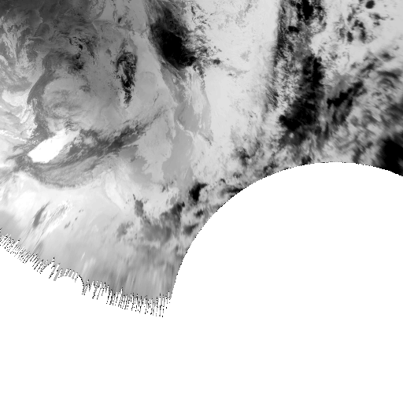

# Полезные ссылки

> &nbsp;[Список встроенных в Satpy композитов для каждого радиометра](https://github.com/pytroll/satpy/tree/main/satpy/etc/composites)  
> &nbsp;[Built-in Compositors](https://satpy.readthedocs.io/en/latest/composites.html#built-in-compositors)  
> &nbsp;[Список встроенных в Satpy enhancements для каждого радиометра](https://github.com/pytroll/satpy/tree/main/satpy/etc/enhancements) <- здесь также стоит заглянуть в generic.yaml - там содержатся enhancements по дефолту.  
> &nbsp;[Создание конфигураций Композитов](https://satpy.readthedocs.io/en/latest/composites.html#creating-composite-configuration-files)  
> &nbsp;[Создание конфигураций Enhance'ров](https://satpy.readthedocs.io/en/latest/composites.html#enhancing-the-images)  
> &nbsp;[Модификаторы](https://satpy.readthedocs.io/en/latest/composites.html#modifiers)  

# Доступные датасеты `satpy==0.53.0`

## Himawari
Есть HRIT файлы для: **IR1, IR2, IR3, IR4, VIS**  
Датасеты:  
- [B03](https://drive.google.com/file/d/1PAPkEc7Tp-9E4Ozi6AYlr1wswgM09psy/view?usp=sharing), [B07](https://drive.google.com/file/d/1Ha4GTW0rMD3haIZBcOd4GRkac5kaxTKG/view?usp=sharing), [B08](https://drive.google.com/file/d/1bAxiRVp6nVd1tjoPGjM_Q91KZKGC6ejn/view?usp=sharing), [B13](https://drive.google.com/file/d/1i_wUCGaKQRIWP09fprGxFyF0wDV4IsEJ/view?usp=sharing), [B15](https://drive.google.com/file/d/1H5bAMx0bd8z42DwfVJh0aX2wcyKtXNMM/view?usp=sharing)
- [colorized_ir_clouds](https://drive.google.com/file/d/1zYP8PSkGC_FaeLoEDLm6jcoSaIbFPD2S/view?usp=sharing)
- [geo_color_high_clouds](https://drive.google.com/file/d/1K-4HvMMbKAgfsne_aetfyTbZjQYQ6Ot2/view?usp=sharing)
- [night_ir_alpha](https://drive.google.com/file/d/17s2_t3yUuPA5xud4ET_8X97bAa7KVIDw/view?usp=sharing) 

При загрузке этих:
- geo_color_background_with_low_clouds
- geo_color_low_clouds
- geo_color_night
- night_ir_with_background 
- night_ir_with_background_hires

возникает ошибка: `Can't compare areas with different projections.`  
[HIMAWARI-8/AHI, scene can not load specific composite: "night_ir_with_background" #2090](https://github.com/pytroll/satpy/issues/2090)  
[И еще](https://github.com/pytroll/satpy/issues/1714#issuecomment-853151821)  


# Himawari маппинг каналов

[Himawari Imaging Bands](https://www.data.jma.go.jp/mscweb/en/himawari89/space_segment/spsg_ahi.html#band)

|       | Channel  | µm   |
|-------|----------|------|
| `VIS` | B03      | 0.64 | 
| `IR1` | B13      | 10.4 |
| `IR2` | B15      | 12.4 |
| `IR3` | B08      | 6.2  |
| `IR4` | B07      | 3.9  |
 

# Проблемы и Решения

## Нарезанные тайлы либо полностью черные, либо очень темные цвета

Вы режете тайлы из GeoTIFF'а и на выходе получаете, например, вот такой тайлик:  
  
Но, на самом деле, этот тайл содержит в себе не черноту сплошную, а вот это:  
  

В нашем примере тайл является одноканальным изображением.  
Черноту вместо данных нам показывает просмотрщик.  
Дело в том, что значения в канале находятся не в диапазоне 0-255, а в диапазоне 208-312.  

Чтобы увидеть корректные данные:
1. Надо вполнить stretch значений канала из диапазона 208-312 в диапазон 0-255
2. Либо просмотрщик должен уметь выполнять enhancement и отображать изображение в произвольном диапазоне значений канала.

Но проблема не в результирующем тайле, а в исходном GeoTIFF'е. Это в его канале значения расположены в нестандартном диапазоне.  
Обычно диапазон указан прямо в метаданных:  
```gdalinfo -mm file.tif```  
Output:
```
...
Band 1 Block=9963x1 Type=UInt16, ColorInterp=Gray
    Computed Min/Max=208.000,312.000
  NoData Value=0
```
Помимо кривого диапазона здесь еще одна проблема - `Type=UInt16`. Значение должно быть `Type=Byte`.  
Давайте скорректируем GeoTIFF:  
```gdal_translate -scale 208 312 0 255 -ot Byte file.tif result.tif```  
Теперь на основе `result.tif` можно сгенерить тайлы и они будут корректно отображаться.

Еще один вариант решения задачи - это использовать satpy.  
При создании сцены(`reader='generic_image'`), когда только читается файл, satpy самостоятельно выполняет stretch'инг в диапазон 0-255. 